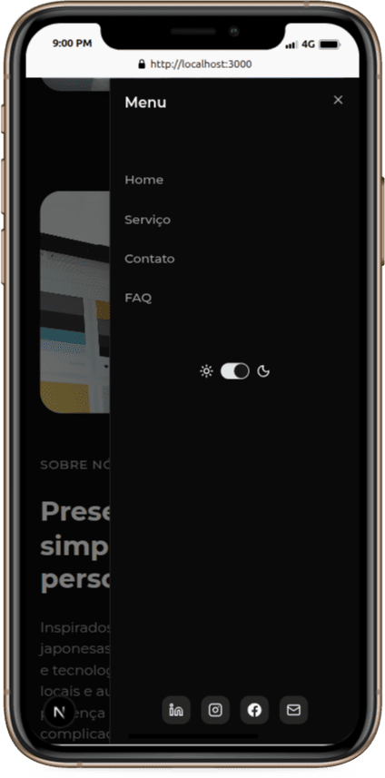

# Konbini Code


Konbini Code is a modern, professional, and fully responsive web application designed to showcase digital services and products with a focus on authenticity, style, and robust technology. Built with Next.js, TypeScript, and Tailwind CSS, the project features a modular architecture, internationalization, advanced UI/UX, 3D animations, and seamless form handling.

---

## Table of Contents
- [Features](#features)
- [Tech Stack](#tech-stack)
- [Project Structure](#project-structure)
- [Getting Started](#getting-started)
- [Usage](#usage)
- [Responsive Design](#responsive-design)
- [Internationalization](#internationalization)
- [Contact & Support](#contact--support)
- [License](#license)

---

## Features
- **Fully Responsive**: Optimized for desktop, tablet, and mobile devices.
- **Internationalization (i18n)**: Multi-language support with dynamic locale routing.
- **Modern UI/UX**: Accessible, themeable (light/dark), and animated interfaces using Radix UI and Tailwind CSS.
- **3D Animations**: Interactive 3D sections powered by Three.js and @react-three/fiber.
- **Modular Components**: Reusable, well-structured components for rapid development.
- **Contact Form**: Validated form with email sending via Resend.
- **Sections**: Hero, About, Services, Models, FAQ, Contact, and more.
- **Notifications**: User feedback and alerts with Sonner.
- **SEO Friendly**: Optimized for search engines and social sharing.

---

## Tech Stack
- **Framework**: [Next.js 15](https://nextjs.org/) (App Router, SSR, ISR)
- **Language**: TypeScript, React 19
- **Styling**: Tailwind CSS 4, PostCSS
- **UI Primitives**: Radix UI, Lucide Icons, React Icons
- **Forms & Validation**: React Hook Form, Zod
- **Internationalization**: next-intl
- **Theme Switching**: next-themes
- **3D & Animation**: Three.js, @react-three/fiber, @react-three/drei
- **Charts**: Recharts
- **Email**: Resend
- **Notifications**: Sonner
- **Testing & Linting**: ESLint, TypeScript

---

### Tablet View


---

## Project Structure
```text
konbinicode/
├── app/                # Next.js app directory (routing, pages, layouts, styles)
│   └── [locale]/       # Locale-based routing and content
├── components/         # UI, layout, and custom React components
│   ├── custom/         # Hero, About, Services, Models, FAQ, ContactForm, etc.
│   ├── layout/         # Header, Footer, etc.
│   └── ui/             # UI primitives (Button, Card, Sidebar, etc.)
├── lib/                # Utility libraries (email, helpers)
├── hooks/              # Custom React hooks
├── i18n/               # Internationalization config
├── messages/           # Translation files (JSON)
├── public/
│   └── readme/         # Screenshots for README
│       ├── desktop.png
│       ├── tablet.png
│       └── mobile.png
├── package.json        # Dependencies and scripts
├── tailwind.config.js  # Tailwind CSS configuration
├── next.config.ts      # Next.js configuration
└── README.md           # Project documentation
```

---


## Deployment & Production Analysis

The project is deployed at: [https://www.konbinicode.com](https://www.konbinicode.com)

### Production Highlights
- **Performance**: The site loads quickly and is optimized for both desktop and mobile devices. SSR/ISR ensures fast content delivery and SEO-friendly rendering.
- **SEO**: Semantic HTML, proper meta tags, and Open Graph data help the site rank well and look great when shared on social media.
- **Internationalization**: The live site offers dynamic locale switching, making it accessible to a global audience.
- **Accessibility**: UI components are built using Radix UI and best practices, ensuring keyboard navigation and screen reader support.
- **Responsive Design**: The interface adapts perfectly across devices, as shown in the screenshots above.
- **Modern Visuals**: The homepage features a bold hero section, animated transitions, and a clean, modern aesthetic. Each section (Hero, About, Services, Models, FAQ, Contact) is visually distinct and easy to navigate.
- **Business Value**: The site highlights the importance of a digital presence, with statistics and persuasive content to convert visitors into clients.
- **Service Portfolio**: Users can explore different service templates and styles, tailored for a variety of business needs.
- **Contact & Social**: Integrated contact form and direct links to social networks (e.g., Instagram) facilitate communication and engagement.
- **Legal & Transparency**: Footer includes company info, rights reserved, and navigation to all key sections.

### Unique Aspects
- **3D Animation**: The Models section leverages Three.js for interactive, visually rich experiences.
- **Live Editing & Feedback**: The contact form provides instant validation and user feedback.
- **Scalable Architecture**: Modular component structure and Next.js features allow for easy expansion and maintenance.

---

### Mobile View


---

## Getting Started

### Prerequisites
- Node.js >= 18.x
- Yarn or npm

### Installation
```bash
git clone https://github.com/yourusername/konbinicode.git
cd konbinicode
yarn install # or npm install
```

### Development
```bash
yarn dev # or npm run dev
```
The app will be available at [http://localhost:3000](http://localhost:3000).

### Production
```bash
yarn build # or npm run build
yarn start # or npm start
```

---

## Usage
- **Navigation**: Use the header or sidebar for smooth navigation between sections.
- **Theme Switching**: Toggle between light and dark modes for optimal viewing.
- **Language Selection**: Switch languages using the locale toggle.
- **Contact**: Fill out the contact form to send a message (emails are handled via Resend).
- **3D Animation**: Explore interactive 3D elements in the Models section.

---

## Internationalization
- Supports multiple languages (e.g., English, Portuguese, Spanish)
- Automatic locale detection and routing
- All content and UI elements are translatable

---

## Contact & Support
- **Email**: konbinicode@gmail.com
- **FAQ**: See the FAQ section on the website for common questions

---

## License
This project is licensed under the MIT License. See [LICENSE](LICENSE) for details.

---

> By the Konbini Code Team
